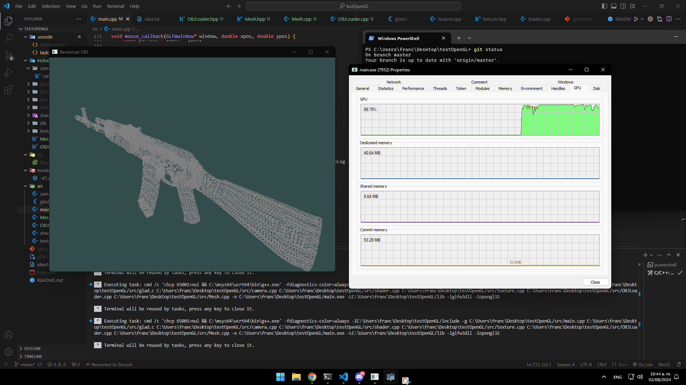

# Basic Camera and Object Rendering in OpenGL

This repository provides a basic setup for an OpenGL camera, including example code for camera movement, perspective projection, and object rendering. Now, the project also includes functionality to load and render a 3D model, such as an AK-47 similar to the one in Counter-Strike.

## Getting Started

### Prerequisites

1. **GLFW:** For window and input management. Download from [GLFW](https://www.glfw.org/download.html).
2. **GLM:** Header-only math library. Get it from [GLM GitHub](https://github.com/g-truc/glm).
3. **GLAD:** OpenGL function loader. Generate the loader code at [GLAD](https://glad.dav1d.de/).

### Setup and Compilation

1. **Extract** GLFW and GLM to your project directory.
2. **Place** GLAD files (`glad.c` and `glad.h`) in your project.
3. **Add** your 3D model (e.g., AK-47.obj) to the `models` directory.
4. **Compile** the project using the provided `tasks.json` in the `.vscode` folder. This file is set up for building with Visual Studio Code.
5. **Run** the resulting executable to see the camera in action and the 3D model rendered.

### Usage

The project includes basic camera controls and now supports object rendering. Use keyboard and mouse input to move and rotate the camera. The AK-47 model will be rendered in the scene.

### Camera Controls

- **W**: Move forward
- **S**: Move backward
- **A**: Move left
- **D**: Move right
- **Mouse**: Look around
- **Scroll**: Zoom in/out

---

Feel free to modify the code for your needs. If you have any questions, feel free to reach out!

